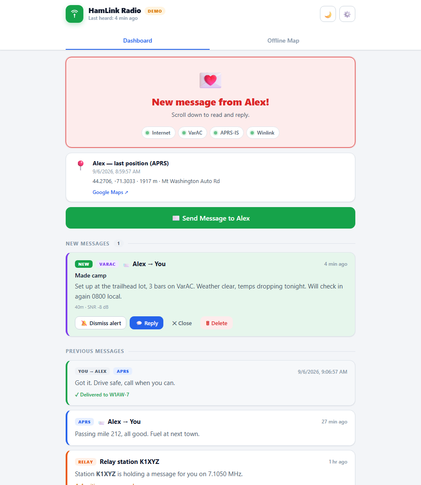
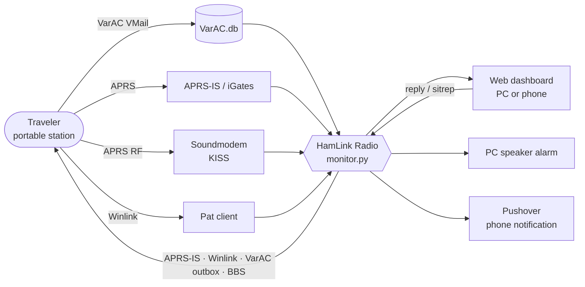

<p align="center">
  
</p>

<p align="center">
  <a href="https://github.com/KK4ODA/HamLink-Radio/releases/latest"></a>
  
  
  <a href="https://github.com/KK4ODA/HamLink-Radio/issues"></a>
</p>

**HamLink Radio** is a family emergency-communications dashboard for licensed amateur radio operators. It watches **VarAC**, **APRS**, and **Winlink** for check-in messages from a traveling loved one, alerts the family at home (on screen, by speaker, and by phone), and lets them reply or post a family status report — all from a simple web page that needs no ham radio knowledge to use.

<p align="center">
  
</p>

## Features

**Monitoring**
- **Three channels, one inbox** — VarAC VMail (polls `VarAC.db`), APRS messages over APRS-IS and RF, and Winlink through the Pat client.
- **Position tracking** — APRS beacons, Winlink position reports, and an aprs.fi backfill on startup so you never miss movement that happened while the app was off. Shown on the dashboard and on an **offline map** (MBTiles).
- **Relay awareness** — tracks VarAC relay notifications, can auto-retrieve held VMails through VarAC's UI, and routes replies back through the same relay.

**Alerting**
- **Three-layer alarm** — PC speaker beep (works with the browser closed), browser sound or voice alert, and browser notifications.
- **Phone notifications** — Pushover push with optional one-tap quick replies (each confirmed on a web page before anything is sent) and a "dismiss alarm" link.

**Replying**
- **Send on any channel** — APRS-IS, Winlink telnet, or the VarAC outbox, individually or all at once, with quick-reply buttons.
- **Sitrep system** — post a structured family status report (house, vehicles, utilities, health, needs, relocation) to the VarAC BBS with one tap; HamLink announces it with a 500 Hz VarAC broadcast so nearby stations can relay it.
- **RF fallback** — when the internet is down, APRS can go out through Soundmodem and Winlink through a VARA FM gateway. Both are blocked by default behind a licensed-operator / emergency confirmation (FCC 97.221, 97.403).

**Built for the kitchen table**
- Big, clear status card; colour-coded message cards; light and dark themes; works on a PC or a phone on the same network.
- Persistent CSV log of everything sent and received, graceful shutdown that also closes VarAC, Soundmodem, Pat, and VARA FM.
- FCC Part 97 compliance notice on first launch and RF-path labels on every send.

## How it works



The whole application is one Python file, `monitor.py`: a Flask backend with background threads for each channel, plus the embedded HTML/CSS/JS dashboard. That is deliberate — one file to copy, nothing to build, nothing to break in an emergency.

## Quick start

### Option A — standalone Windows app (no Python)

1. Download `HamLink-Radio-vX.Y.Z-win64.zip` from the [latest release](https://github.com/KK4ODA/HamLink-Radio/releases/latest) and unzip it anywhere.
2. Run `HamLink_Radio.exe`. It creates `config.json` next to itself and opens `http://127.0.0.1:5000`.

### Option B — from source

1. Install [Python 3.8+](https://www.python.org/downloads/) (tick **Add Python to PATH**).
2. Download the source zip from the release page, or `git clone https://github.com/KK4ODA/HamLink-Radio.git`.
3. Double-click **`start_hamlink.bat`** — it installs the dependencies from `requirements.txt` and opens the dashboard.

### First run

1. Accept the regulatory compliance notice, then tap **Start Monitoring** (this unlocks alert sounds in the browser).
2. Open **Settings** (⚙️) and fill in *People & callsigns* and the *VarAC database path* (use **Browse**, then **Test**).
3. Enable APRS, Winlink, Pushover, and the offline map as needed. Every field has a hint.

Print **[docs/QUICK_REFERENCE.md](docs/QUICK_REFERENCE.md)** for both people — one page on how to reach each other. See **[MANUAL.md](MANUAL.md)** for the complete guide: configuration, use cases, sitreps, troubleshooting, and the FCC compliance section.

### Try it without any radio software

```bat
set HAMLINK_DEMO=1
python monitor.py
```

Demo mode fills the dashboard with sample messages and a position so you can explore the UI. Nothing is transmitted, no external programs are launched, and no VarAC database is opened.

## Updating

HamLink checks GitHub for a new release shortly after it starts and every few hours after that (Settings → Updates). When one is found, a banner appears at the top of the dashboard:

- **What's new** opens the release notes.
- **Update now** downloads the matching asset for your install (the `.exe` for the standalone app, the source zip for a source install), installs it, and restarts HamLink. Your `config.json`, message log, and map tiles are kept; a source install keeps the previous `monitor.py` as `monitor.py.bak`.
- **Later** hides the banner for that version. You can always check manually from the footer link or Settings → Updates → **Check now**.

If you run HamLink from a `git clone`, the in-app updater steps aside and tells you to `git pull`.

## Requirements

| Component | Needed for |
|---|---|
| Windows 10/11, Python 3.8+ (or the standalone `.exe`) | Everything |
| [VarAC](https://www.varac-hamradio.com/) V5+ with VARA HF | VMail monitoring, replies, sitreps, relay automation |
| [Pat](https://getpat.io) | Winlink (internet, or RF via VARA FM) |
| [UZ7HO Soundmodem](http://uz7.ho.ua/packetradio.htm) | APRS over RF |
| VARA FM | Winlink RF fallback |
| [Pushover](https://pushover.net) account | Phone notifications |

Python packages (installed automatically by the launcher): `flask`, `aprslib`, and on Windows `pywin32` + `comtypes` for VarAC UI automation.

## Project layout

```
monitor.py              The entire application: Flask backend, channel threads, embedded UI
start_hamlink.bat       Windows launcher — checks Python, installs requirements, opens the browser
build_hamlink_exe.bat   Builds the standalone .exe with PyInstaller
requirements.txt        Python dependencies
MANUAL.md               User manual (configuration, use cases, FCC compliance, troubleshooting)
pat-interface-notes.md  Notes on Pat's HTTP API
static/                 Leaflet.js + marker icons for the offline map
tiles/                  Drop your <state>.mbtiles file here (see tiles/README.txt)
docs/                   Banner, icon, screenshots
config.json             Created on first run — your settings (not tracked in git)
message_log.csv         Created on first run — persistent message log (not tracked in git)
```

## FCC compliance

HamLink Radio is designed for use by licensed amateur radio operators under FCC Part 97 in the United States. The station licensee is responsible for all transmissions from the station.

- Replies over **APRS-IS**, **Winlink telnet**, and the **VarAC outbox** involve no RF transmission from the home station at the time of sending.
- **Sitrep broadcasts** use VARA HF at 500 Hz, which is permitted under automatic control (97.115(c), 97.221).
- **APRS via Soundmodem** and **Winlink via VARA FM** exceed 500 Hz and are blocked by default. Sending requires confirming that a licensed operator is present or supervising, or invoking the emergency exception (97.403).

The full discussion is in the manual's [FCC Compliance](MANUAL.md#9-fcc-compliance) section.

## Releases

Releases are built automatically: pushing a tag like `v0.3.0` creates a GitHub release with a source zip and a standalone Windows `.exe`, with a changelog generated from the commit messages (`feat:`, `fix:`, `docs:` prefixes are grouped).

```bash
git tag -a v0.3.0 -m "v0.3.0" && git push origin v0.3.0
```

## Contributing

Bug reports and feature requests are welcome in [GitHub Issues](https://github.com/KK4ODA/HamLink-Radio/issues). Pull requests too — keep it in one file.

## License

[MIT](LICENSE). 73 de KK4ODA.
